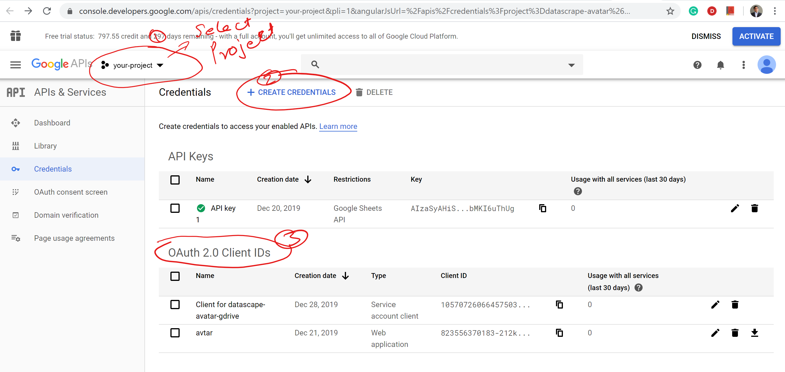

# Crowdsouce Editor Setup

1. Go to URL: https://console.developers.google.com/apis/credentials
2. Create a Project
3. Follow below screenshot to get your Auth IDs.  

<a href="img/google-setup.png">

